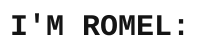
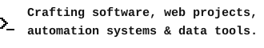
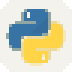
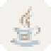
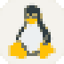

  

  <picture><source media="(prefers-color-scheme: dark)" srcset="assets/typing-dark.svg" /></picture>

<h3 align="center">
  <picture><source media="(prefers-color-scheme: dark)" srcset="assets/headings/who-dark.svg" /></picture>
</h3>

  🇲🇽 I'm a Mexican Computer Engineering dancer 💃 
  🎓 I study at the @UNAM 
  🍬 I like gummies and mints 🍃

  <picture><source media="(prefers-color-scheme: dark)" srcset="assets/about-4-dark.svg" /></picture>

 

<h3 align="center">
  <picture><source media="(prefers-color-scheme: dark)" srcset="assets/headings/skills-dark.svg" /></picture>
</h3>

<table align="center">
  <tr>
    <td rowspan="3" align="center" valign="middle"></td>
    <td align="center" width="140"><picture><source media="(prefers-color-scheme: dark)" srcset="assets/skills/python-dark.svg" /></picture> <b>Python</b></td>
    <td align="center" width="140"><picture><source media="(prefers-color-scheme: dark)" srcset="assets/skills/java-dark.svg" /></picture> <b>Java</b></td>
    <td align="center" width="140"><picture><source media="(prefers-color-scheme: dark)" srcset="assets/skills/c-dark.svg" /></picture> <b>C</b></td>
    <td rowspan="3" align="center" valign="middle"></td>
  </tr>
  <tr>
    <td align="center" width="140"><picture><source media="(prefers-color-scheme: dark)" srcset="assets/skills/cpp-dark.svg" /></picture> <b>C++</b></td>
    <td align="center" width="140"><picture><source media="(prefers-color-scheme: dark)" srcset="assets/skills/html-dark.svg" /></picture> <b>HTML</b></td>
    <td align="center" width="140"><picture><source media="(prefers-color-scheme: dark)" srcset="assets/skills/arduino-dark.svg" /></picture> <b>Arduino</b></td>
  </tr>
  <tr>
    <td align="center" width="140"><picture><source media="(prefers-color-scheme: dark)" srcset="assets/skills/github-dark.svg" /></picture> <b>GitHub</b></td>
    <td align="center" width="140"><picture><source media="(prefers-color-scheme: dark)" srcset="assets/skills/linux-dark.svg" /></picture> <b>Linux</b></td>
    <td align="center" width="140"><picture><source media="(prefers-color-scheme: dark)" srcset="assets/skills/fedora-dark.svg" /></picture> <b>Fedora</b></td>
  </tr>
</table>

 

<h3 align="center">
  <picture><source media="(prefers-color-scheme: dark)" srcset="assets/headings/certs-dark.svg" /></picture>
</h3>

  <i>Coming soon... 🚧</i>

 

<h3 align="center">
  <picture><source media="(prefers-color-scheme: dark)" srcset="assets/headings/contrib-dark.svg" /></picture>
</h3>

  

 

<h3 align="center">
  <picture><source media="(prefers-color-scheme: dark)" srcset="assets/headings/contact-dark.svg" /></picture>
</h3>

  
  
  

